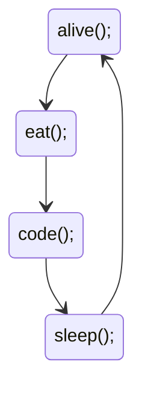

Hello :) 

I love making apps that make life easier. I want to combine my design experience with programming and take part in larger projects in this field.

<details>

<summary>For Funny</summary>


<!--START_SECTION:waka-->


**🐱 My GitHub Data** 

> 🏆 610 Contributions in the Year 2022
 > 
> 📦 77.9 kB Used in GitHub's Storage 
 > 
> 💼 Opted to Hire
 > 
> 📜 53 Public Repositories 
 > 
> 🔑 2 Private Repositories  
 > 
**I'm a Night 🦉** 

```text
🌞 Morning    90 commits     ████░░░░░░░░░░░░░░░░░░░░░   16.57% 
🌆 Daytime    162 commits    ███████░░░░░░░░░░░░░░░░░░   29.83% 
🌃 Evening    136 commits    ██████░░░░░░░░░░░░░░░░░░░   25.05% 
🌙 Night      155 commits    ███████░░░░░░░░░░░░░░░░░░   28.55%

```
📅 **I'm Most Productive on Monday** 

```text
Monday       104 commits    ████░░░░░░░░░░░░░░░░░░░░░   19.15% 
Tuesday      56 commits     ██░░░░░░░░░░░░░░░░░░░░░░░   10.31% 
Wednesday    70 commits     ███░░░░░░░░░░░░░░░░░░░░░░   12.89% 
Thursday     70 commits     ███░░░░░░░░░░░░░░░░░░░░░░   12.89% 
Friday       102 commits    ████░░░░░░░░░░░░░░░░░░░░░   18.78% 
Saturday     59 commits     ██░░░░░░░░░░░░░░░░░░░░░░░   10.87% 
Sunday       82 commits     ███░░░░░░░░░░░░░░░░░░░░░░   15.1%

```


📊 **This Week I Spent My Time On** 

```text
⌚︎ Time Zone: Europe/Istanbul

💬 Programming Languages: 
TypeScript               5 hrs 59 mins       █████████████████████░░░░   87.41% 
CSS                      30 mins             █░░░░░░░░░░░░░░░░░░░░░░░░   7.44% 
Bash                     8 mins              ░░░░░░░░░░░░░░░░░░░░░░░░░   1.98% 
JSON                     4 mins              ░░░░░░░░░░░░░░░░░░░░░░░░░   1.05% 
XML                      4 mins              ░░░░░░░░░░░░░░░░░░░░░░░░░   1.0%

🐱‍💻 Projects: 
frontendship             6 hrs 23 mins       ███████████████████████░░   93.02% 
hangman                  20 mins             █░░░░░░░░░░░░░░░░░░░░░░░░   4.89% 
.zsh_sessions            8 mins              ░░░░░░░░░░░░░░░░░░░░░░░░░   2.09%

```

**I Mostly Code in JavaScript** 

```text
JavaScript               20 repos            ████████████░░░░░░░░░░░░░   47.62% 
HTML                     7 repos             ████░░░░░░░░░░░░░░░░░░░░░   16.67% 
CSS                      6 repos             ███░░░░░░░░░░░░░░░░░░░░░░   14.29% 
Swift                    5 repos             ███░░░░░░░░░░░░░░░░░░░░░░   11.9% 
TypeScript               3 repos             █░░░░░░░░░░░░░░░░░░░░░░░░   7.14%

```


 Last Updated on 08/11/2022 19:01:08 UTC
<!--END_SECTION:waka-->

</details>
